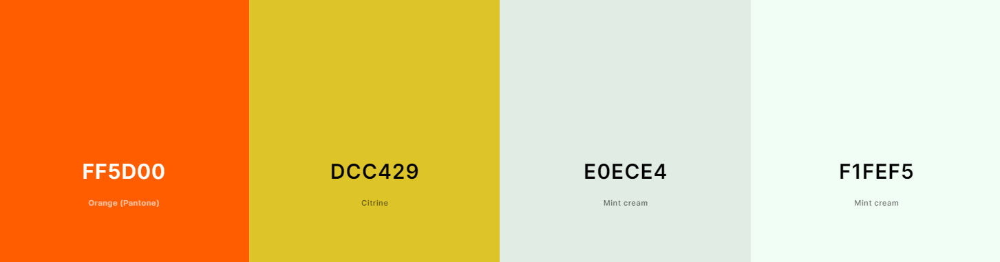
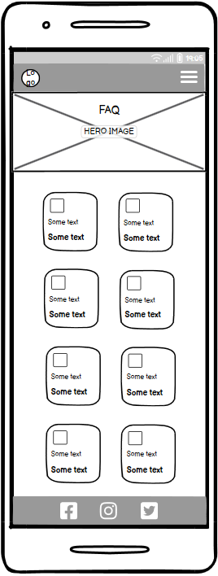
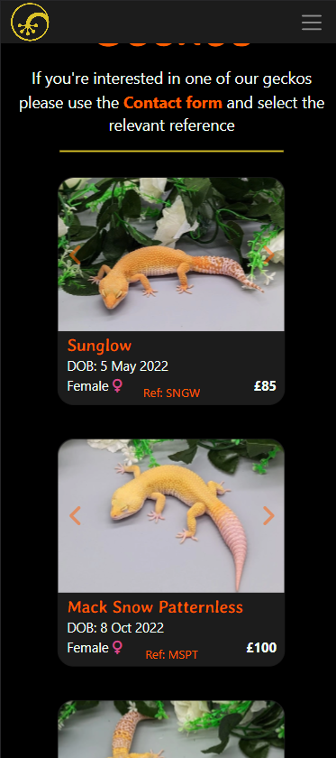
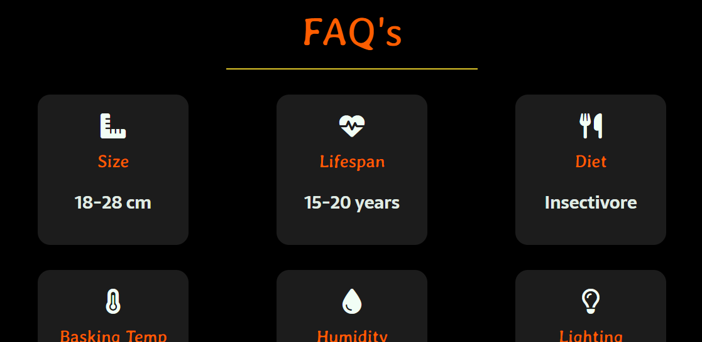
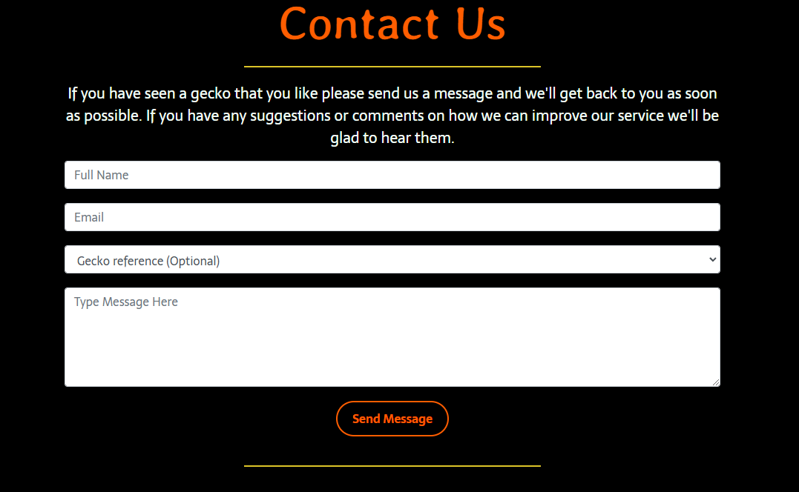

# LUNA'S LEOPARD GECKOS

Luna's Leopard Geckos are an enthusiastic hobbyist breeder. They have been successfully breeding geckos for many years with their most recent aim to reach a wider audience of like minded reptile keepers and provide them with high quality and healthy pets.

On this site users will find a brief description of who the client is, reassuring users that they will be purchasing from a reputable breeder. Users can also find a catalogue of available geckos along with a FAQ page that will be especially helpful to new keepers.

Users can get in contact with the client via the contact page or by redirecting to their social pages.

[View the live site here](https://dougyb83.github.io/Lunas-Leopard-Geckos)

## UX

Upon landing on the home page I wanted it to be clear to the user that the site is focused on Leopard geckos and selling them. As Leopard geckos are naturally very colourful, bright and vibrant it makes sense to have a picture of one as the main focus point. This will be the hero image. It will be the full width of the screen but will not be the full height so that users can see that there is more to see below if they were to scroll down.

### Colour Scheme

Leopard geckos can have many bright colours, but the most common are yellow or orange with black and white stripes and dots. this will influence the colour scheme using black/grey for the background and nav bar, yellow for logo's and orange for buttons and sub headings. But keeping main titles and text white as I feel adding colours to these made them more difficult to read.

- `#f1fef5` used for primary text.
- `#ff5d00` used for primary highlights.
- `#e0ece4` used for secondary text.
- `#dcc429` used for secondary highlights.

I used [coolors.co](https://coolors.co/ff5d00-dcc429-e0ece4-f1fef5) to generate my colour palette.

### Typography

[fontjoy.com](https://fontjoy.com/) was used to help generate font pairings as follows:

- [Montserrat](https://fonts.google.com/specimen/Montserrat) was used for the primary headers.
- [Averia Gruesa Libre](https://fonts.google.com/specimen/Averia+Gruesa+Libre) was used for sub headings.
- [Sarala](https://fonts.google.com/specimen/Sarala) was used for all other secondary text.

[Montserrat](https://fonts.google.com/specimen/Montserrat) and [Sarala](https://fonts.google.com/specimen/Sarala) were selected as they are both readable and clear fonts which is ideal for main headings and large sections of text. [Averia Gruesa Libre](https://fonts.google.com/specimen/Averia+Gruesa+Libre) was choosen for its more stylistic properties to break the text up and give the page more character.

[Font Awesome](https://fontawesome.com) icons were used throughout the site, such as the social media icons in the footer.

### New Site Users

- I would like to quickly see the sites purpose.
- I would like to see clear navigation, so that I can easily move back and forward between pages.
- I would like any information to be clear and to the point, so that I can make an informed decision.
- I would like to be able to contact the site owner, so that I can make a purchase.
- I would like to find the sites social media pages.
- I would like to view the site on any device.

### Returning Site Users

- I would like to see up to date stock information.
- I would like to look at new pictures.
- I would like to refresh my knowledge by viewing fact references.

### Site Admin

- The code should have proper indentation so that it is clear for myself and others to read.
- The code should be properly signposted to make it easy to navigate.
- I should be able to manage the sites content, so that i can keep it up to date.
- I should be able to respond to user enquiries.

## Wireframes

To follow best practice, wireframes were developed for mobile, tablet, and desktop sizes.
I've used [Balsamiq](https://balsamiq.com/wireframes) to design my site wireframes.

### Mobile Wireframes

| Size                  | Screenshot                                                        |
| --------------------- | ----------------------------------------------------------------- |
| Home Page             |              |
| Available Geckos Page |  |
| FAQ Page              |               |
| Contact Page          |        |

### Tablet Wireframes

| Size                  | Screenshot                                                        |
| --------------------- | ----------------------------------------------------------------- |
| Home Page             |              |
| Available Geckos Page |  |
| FAQ Page              |               |
| Contact Page          |        |

### Desktop Wireframes

| Size                  | Screenshot                                                         |
| --------------------- | ------------------------------------------------------------------ |
| Home Page             |              |
| Available Geckos Page |  |
| FAQ Page              |               |
| Contact Page          |        |

## Features

The website has four main pages, all of which are accessible from the navigation bar which is fixed at the top of each page. There are an additional two pages, one is a 404 error page which will be loaded if 
the user navigates to an invalid address as well as a confirmation page which loads after the user submits the contact form.

### Existing Features

- **Navbar**

  - The navbar is fixed to the top of each page allowing for the user to easily navigate to and from each page within the site. The site's logo is displayed on the left which also links to the homepage. On the right of the navbar is a link to each of the main pages.
  - The link text of the page the user is currently visiting is displayed in bold text to make it clear which page they are on.
  - When the user hover's the mouse over the 'inactive' links the text will become brighter to indicate they are clickable.
  - The navbar is fully responsive and on smaller screens will reduce to a clickable button with a dropdown menu. This is so the text does not become cluttered and to create more screen space.

Navbar as seen on desktop

Navbar as seen on mobile devices

Navbar dropdown menu as seen on mobile devices

- **Footer**

  - Repeated at the bottom of each page is the footer. It has a picture of a leopard gecko than spans the full width of the screen and when fully in view takes up 30% fo the viewport height. In the center are three social media icons which, on mouse hover will change colour to yellow and when clicked, will open up a new tab so as not to take the user away from our page. To the left is the sites logo which links to the homepage and on the right is some copyright information.

Here the footer can be seen with the highlighted Facebook icon.

- **Hero Image**

  - Each of the main pages has it's own hero image of a leopard gecko to draw the user in. The hero images span the full width of the page but do not cover the full height. This is so the user can see that there is more to be seen further down the page.

Here we can see the hero image as displayed on the contact page where the user is drawn further down the page with the visibilty of more information.

- **Homepage**

  - A jumbotron is displayed over the hero image with the name of the page displayed in large text followed by a one line description of what we do and a button style link. The button when hovered overturns solid orange to indicate it is clickable, this links to the 'available geckos' page.

  - An about section with a brief description of who we are and what we offer

  - A static gallery to show some of the sites available geckos with a button that also turns solid orange when hovered over. This links to the 'available geckos' page. The static galler reduces down to two images when viewed on mobile devices.

Jumbotron.

About us.

Static gallery viewed on desktop.

Static gallery when viewed on a mobile device.

- **Available Geckos page**

  - Here we have one card displayed for each available gecko. Each card has a image carousel so the user can see multiple images of the same gecko. The carousel has left and right chevrons for navigation. The cards are fully responsive.

Available gecko cards viewed on desktop.

Available gecko cards when viewed on a mobile device.

- **FAQ page**

  - This page displays cards with information about leopard geckos on them so that users can make informed descisions when deciding whether or not to buy a gecko. 

FAQ cards viewed on desktop.

FAQ cards when viewed on a mobile device.

- **Contact page**

  - Here the user can contact the site owner with the option to refernce a particular gecko if making an enquiry. The 'Send message' button turns solid orange when hovered over. When clicked, the confirmation page will load.

Contact form.

- **Confirmation page**

  - This page displays when a message is submitted on the contact page.
  - The page will refresh to the homepage after 10 seconds.

Confirmation page.

- **Error 404 page**

  - This page displays when the user try's to navigate to a page that doesn't exist.
  - The page will refresh to the homepage after 10 seconds.

Confirmation page.

### Future Features

- Leopard Gecko Care Sheet
  - The FAQ page would be labeled a 'Quick Facts' page to make room for a new page that has much more comprehensive information regarding the care, housing and general husbandry of leopard geckos.
- Waterwheel Carousel
  - The static gallery on the homepage would be replaced with a rotating image reel.
- Add to Cart
  - Implement a 'shopping cart' and make it easier to make a purchase.

## Tools & Technologies Used

- [HTML](https://en.wikipedia.org/wiki/HTML) used for the main site content.
- [CSS](https://en.wikipedia.org/wiki/CSS) used for the main site design and layout.
- [JavaScript](https://www.javascript.com) used for user interaction on the site.
- [Git](https://git-scm.com) used for version control. (`git add`, `git commit`, `git push`)
- [GitHub](https://github.com) used for secure online code storage.
- [GitHub Pages](https://pages.github.com) used for hosting the deployed front-end site.
- [Gitpod](https://gitpod.io) used as a cloud-based IDE for development.
- [Bootstrap](https://getbootstrap.com) used as the front-end CSS framework for modern responsiveness and pre-built components.

## Testing

For all testing, please refer to the [TESTING.md](TESTING.md) file.

## Deployment

The site was deployed to GitHub Pages. The steps to deploy are as follows:

- In the [GitHub repository](https://github.com/dougyb83/Lunas-Leopard-Geckos), navigate to the Settings tab
- Under the heading "Code and automation", select "Pages".
- From the source section drop-down menu, select the **Main** Branch, then click "Save".
- The page will be automatically refreshed with a detailed ribbon display to indicate the successful deployment.

[View the live site here](https://dougyb83.github.io/Lunas-Leopard-Geckos)

### Local Deployment

This project can be cloned or forked in order to make a local copy on your own system.

#### Cloning

You can clone the repository by following these steps:

1. Go to the [GitHub repository](https://github.com/dougyb83/Lunas-Leopard-Geckos)
2. Locate the Code button above the list of files and click it
3. Select if you prefer to clone using HTTPS, SSH, or GitHub CLI and click the copy button to copy the URL to your clipboard
4. Open Git Bash or Terminal
5. Change the current working directory to the one where you want the cloned directory
6. In your IDE Terminal, type the following command to clone my repository:
   - `git clone https://github.com/dougyb83/Lunas-Leopard-Geckos.git`
7. Press Enter to create your local clone.

Alternatively, if using Gitpod, you can click below to create your own workspace using this repository.

Please note that in order to directly open the project in Gitpod, you need to have the browser extension installed.
A tutorial on how to do that can be found [here](https://www.gitpod.io/docs/configure/user-settings/browser-extension).

#### Forking

By forking the GitHub Repository, we make a copy of the original repository on our GitHub account to view and/or make changes without affecting the original owner's repository.
You can fork this repository by using the following steps:

1. Log in to GitHub and locate the [GitHub Repository](https://github.com/dougyb83/Lunas-Leopard-Geckos)
2. At the top right of the Repository but below the navbar, locate the "Fork" Button.
3. Once clicked, you should now have a copy of the original repository in your own GitHub account!

### Local VS Deployment

⚠️⚠️⚠️⚠️⚠️ START OF NOTES (to be deleted) ⚠️⚠️⚠️⚠️⚠️

Use this space to discuss any differences between the local version you've developed, and the live deployment site on GitHub Pages.

🛑🛑🛑🛑🛑 END OF NOTES (to be deleted) 🛑🛑🛑🛑🛑

## Credits

⚠️⚠️⚠️⚠️⚠️ START OF NOTES (to be deleted) ⚠️⚠️⚠️⚠️⚠️

In this section you need to reference where you got your content, media, and extra help from.
It is common practice to use code from other repositories and tutorials,
however, it is important to be very specific about these sources to avoid plagiarism.

🛑🛑🛑🛑🛑 END OF NOTES (to be deleted) 🛑🛑🛑🛑🛑

### Content

⚠️⚠️⚠️⚠️⚠️ START OF NOTES (to be deleted) ⚠️⚠️⚠️⚠️⚠️

Use this space to provide attribution links to any borrowed code snippets, elements, or resources.
A few examples have been provided below to give you some ideas.

Ideally, you should provide an actual link to every resource used, not just a generic link to the main site!

🛑🛑🛑🛑🛑 END OF NOTES (to be deleted) 🛑🛑🛑🛑🛑

| Source                                                                   | Location           | Notes                                            |
| ------------------------------------------------------------------------ | ------------------ | ------------------------------------------------ |
| [Markdown Builder](https://traveltimn.github.io/markdown-builder)           | README and TESTING | tool to help generate the Markdown files         |
| [Chris Beams](https://chris.beams.io/posts/git-commit)                      | version control    | "How to Write a Git Commit Message"              |
| [W3Schools](https://www.w3schools.com/howto/howto_js_topnav_responsive.asp) | entire site        | responsive HTML/CSS/JS navbar                    |
| [W3Schools](https://www.w3schools.com/howto/howto_css_modals.asp)           | contact page       | interactive pop-up (modal)                       |
| [W3Schools](https://www.w3schools.com/css/css3_variables.asp)               | entire site        | how to use CSS :root variables                   |
| [Flexbox Froggy](https://flexboxfroggy.com/)                                | entire site        | modern responsive layouts                        |
| [Grid Garden](https://cssgridgarden.com)                                    | entire site        | modern responsive layouts                        |
| [StackOverflow](https://stackoverflow.com/a/2450976)                        | quiz page          | Fisher-Yates/Knuth shuffle in JS                 |
| [YouTube](https://www.youtube.com/watch?v=YL1F4dCUlLc)                      | leaderboard        | using `localStorage()` in JS for high scores   |
| [YouTube](https://www.youtube.com/watch?v=u51Zjlnui4Y)                      | PP3 terminal       | tutorial for adding color to the Python terminal |
| [strftime](https://strftime.org)                                            | CRUD functionality | helpful tool to format date/time from string     |
| [WhiteNoise](http://whitenoise.evans.io)                                    | entire site        | hosting static files on Heroku temporarily       |

### Media

⚠️⚠️⚠️⚠️⚠️ START OF NOTES (to be deleted) ⚠️⚠️⚠️⚠️⚠️

Use this space to provide attribution links to any images, videos, or audio files borrowed from online.
A few examples have been provided below to give you some ideas.

If you're the owner (or a close acquaintance) of all media files, then make sure to specify this.
Let the assessors know that you have explicit rights to use the media files within your project.

Ideally, you should provide an actual link to every media file used, not just a generic link to the main site!
The list below is by no means exhaustive. Within the Code Institute Slack community, you can find more "free media" links
by sending yourself the following command: `!freemedia`.

🛑🛑🛑🛑🛑 END OF NOTES (to be deleted) 🛑🛑🛑🛑🛑

| Source                                                        | Location     | Type  | Notes                                        |
| ------------------------------------------------------------- | ------------ | ----- | -------------------------------------------- |
| [Pexels](https://www.pexels.com)                                 | entire site  | image | favicon on all pages                         |
| [Lorem Picsum](https://picsum.photos)                            | home page    | image | hero image background                        |
| [Unsplash](https://unsplash.com)                                 | product page | image | sample of fake products                      |
| [Pixabay](https://pixabay.com)                                   | gallery page | image | group of photos for gallery                  |
| [Wallhere](https://wallhere.com)                                 | footer       | image | background wallpaper image in the footer     |
| [This Person Does Not Exist](https://thispersondoesnotexist.com) | testimonials | image | headshots of fake testimonial images         |
| [Audio Micro](https://www.audiomicro.com/free-sound-effects)     | game page    | audio | free audio files to generate the game sounds |
| [Videvo](https://www.videvo.net/)                                | home page    | video | background video on the hero section         |
| [TinyPNG](https://tinypng.com)                                   | entire site  | image | tool for image compression                   |

### Acknowledgements

⚠️⚠️⚠️⚠️⚠️ START OF NOTES (to be deleted) ⚠️⚠️⚠️⚠️⚠️

Use this space to provide attribution to any supports that helped, encouraged, or supported you throughout the development stages of this project.
A few examples have been provided below to give you some ideas.

🛑🛑🛑🛑🛑 END OF NOTES (to be deleted) 🛑🛑🛑🛑🛑

- I would like to thank my Code Institute mentor, [Tim Nelson](https://github.com/TravelTimN) for their support throughout the development of this project.
- I would like to thank the [Code Institute](https://codeinstitute.net) tutor team for their assistance with troubleshooting and debugging some project issues.
- I would like to thank the [Code Institute Slack community](https://code-institute-room.slack.com) for the moral support; it kept me going during periods of self doubt and imposter syndrome.
- I would like to thank my partner (John/Jane), for believing in me, and allowing me to make this transition into software development.
- I would like to thank my employer, for supporting me in my career development change towards becoming a software developer.
