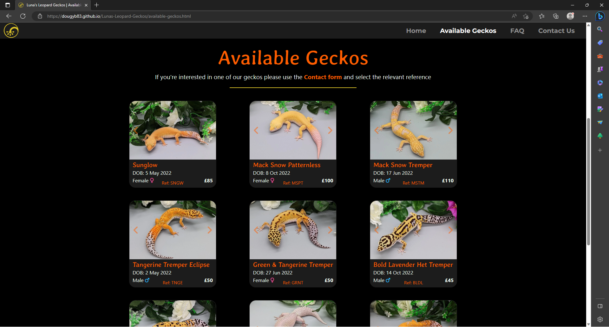
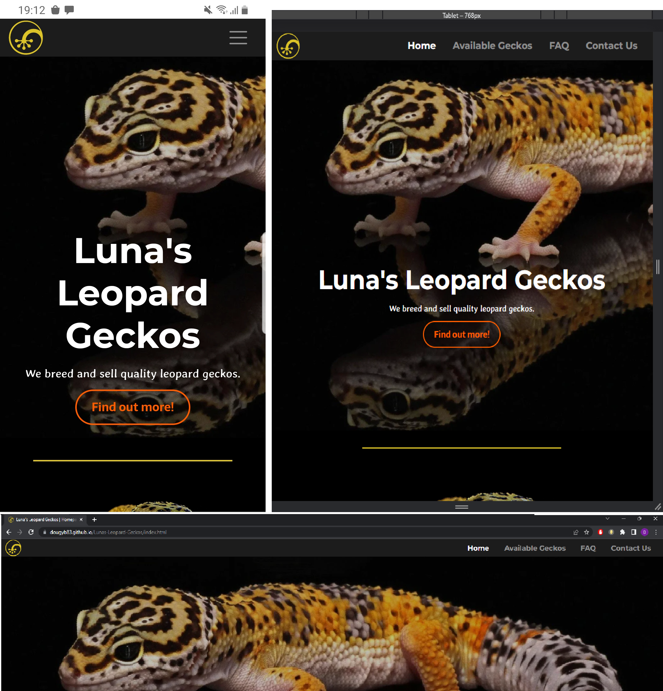
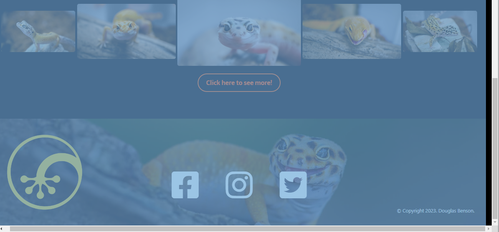
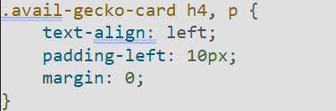
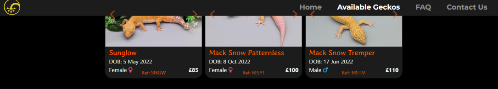
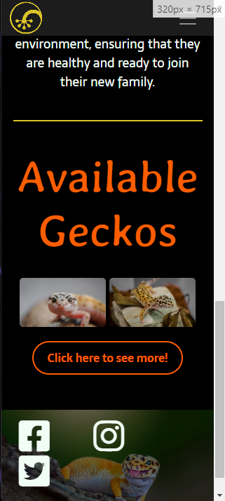

# Testing

Return back to the [README.md](README.md) file.

## Code Validation

### HTML

I have used the recommended [HTML W3C Validator](https://validator.w3.org) to validate all of my HTML files.

| Page     | W3C URL                                                                                                     | Screenshot                                              | Notes                               |
| -------- | ----------------------------------------------------------------------------------------------------------- | ------------------------------------------------------- | ----------------------------------- |
| Home     | [W3C](https://validator.w3.org/nu/?doc=https://dougyb83.github.io/Lunas-Leopard-Geckos/index.html)   |      | Pass: No Errors  |
| Available geckos  | [W3C](https://validator.w3.org/nu/?doc=https://dougyb83.github.io/Lunas-Leopard-Geckos/available-geckos.html) |   | Section lacks heading h2-h6 warning            |
| FAQ     | [W3C](https://validator.w3.org/nu/?doc=https://dougyb83.github.io/Lunas-Leopard-Geckos/faq.html)    |      | Section lacks heading h2-h6 warning                     |
| Contact | [W3C](https://validator.w3.org/nu/?doc=https://dougyb83.github.io/Lunas-Leopard-Geckos/contact.html)   |  | Section lacks heading h2-h6 warning      |
| Confirmation |[W3C](https://validator.w3.org/nu/?doc=https://dougyb83.github.io/Lunas-Leopard-Geckos/confirmation.html)    |  | Pass: No Errors                     |
| 404        | [W3C](https://validator.w3.org/nu/?doc=https://dougyb83.github.io/Lunas-Leopard-Geckos/404.html)  |  | Pass: No Errors |

### CSS

I have used the recommended [CSS Jigsaw Validator](https://jigsaw.w3.org/css-validator) to validate all of my CSS files.

| File         | Jigsaw URL                                                                                                       | Screenshot                                             | Notes                              |
| ------------ | ---------------------------------------------------------------------------------------------------------------- | ------------------------------------------------------ | ---------------------------------- |
| style.css    | [Jigsaw](https://jigsaw.w3.org/css-validator/validator?uri=https%3A%2F%2Fdougyb83.github.io%2FLunas-Leopard-Geckos) |     | Pass: No Errors                    |

## Browser Compatibility

I've tested my deployed project on multiple browsers to check for compatibility issues.

| Browser           | Screenshot                                     | Screenshot                                     | Screenshot                                     | Screenshot                                     | Notes                                |
| ----------------- | ---------------------------------------------- | ---------------------------------------------- | ---------------------------------------------- | ---------------------------------------------- | ------------------------------------ |
| Chrome            |   |   |   |   | Works as expected                    |
| Firefox           |   |   |   |   | Works as expected                    |
| Edge              |   |   |   |   | Works as expected                    |
| Brave             |   |   |   |   | Works as expected                    |
| Opera             |   |   |   |   | Works as expected                    |

## Responsiveness

I've tested my deployed project on multiple devices to check for responsiveness issues.

| Device             | Screenshot                                        | Screenshot                                        | Screenshot                                        | Screenshot                                        | Notes                               |
| ------------------ | ------------------------------------------------- | ------------------------------------------------- | ------------------------------------------------- | ------------------------------------------------- | ----------------------------------- |
| Mobile (DevTools)  |   |   |  |  |Works as expected                   |
| Tablet (DevTools)  |   |   |  |  |Works as expected                   |
| Desktop            |  |   |  |  |Works as expected                |
| Google Pixel 4a |    |   |  |  | Works as expected                  |
| Samsung Galaxy S8          |   |   |  |  | Works as expected                  |
| Samsung Galaxy S21 Ultra          |   |   |  |  | Works as expected                   |
| Samsung Galaxy tab 4          |   |   |  |  | Works as expected                   |

## Lighthouse Audit

I've tested my deployed project using the Lighthouse Audit tool to check for any major issues.

| Page    | Size    | Screenshot                                                | Notes                                   |
| ------- | ------- | --------------------------------------------------------- | --------------------------------------- |
| Home    | Mobile  |      | Some minor warnings                     |
| Home    | Desktop |     | No major problems                            |
| Available Geckos   | Mobile  |     | No major problems                     |
| Available Geckos   | Desktop |    | No major problems                            |
| FAQ | Mobile  |   | Some minor warnings  |
| FAQ | Desktop |  | No major problems  |
| Contact | Mobile |  | No major problems  |
| Contact | Desktop |  | No major problems  |

## User Story Testing

| User Story                                                                             | Screenshot                               |
| -------------------------------------------------------------------------------------- | ---------------------------------------- |
| As a new site user, I would like to quickly see the sites purpose.          |  |
| As a new site user, I would like to see clear navigation, so that I can easily move back and forward between pages.          |  |
| As a new site user, I would like any information to be clear and to the point, so that I can make an informed decision.          |  |
| As a new site user, I would like to be able to contact the site owner, so that I can make a purchase.          |  |
| As a new site user, I would like to find the sites social media pages.          |  |
| As a new site user, I would like to view the site on any device.          |  |
| As a returning site user, I would like to see up to date stock information.    |  |
| As a returning site user, I would like to refresh my knowledge by viewing fact references.    |  |
| As a site administrator, The code should have proper indentation so that it is clear for myself and others to read. |  |
| As a site administrator, The code should be properly signposted to make it easy to navigate. |  |
| As a site administrator, I should be able to respond to user enquiries. |  |

## Bugs

- Navbar not reaching page edges

  

  - To fix this, I set padding-left and padding-right to 0.

- Vertical space on right side of homepage

  

  - When implementing the 'static gallery' on the home page I initially hadn't placed a 'container' before the bootrap row and column that the 'static gallery' was inside of. Adding this container fixed the issue.

- CSS class affecting uninteded elements

  

  - I found that this class was affecting 'p' elements that were within other classes, where my intention was to only affect the 'p' elements withing 'avail-geck-card'. I later discover my sytax was incorrect and fixed the problem by targeting the 'h4' and 'p' element separately i.e. '.avail-gecko-card h4{}' and '.avail-gecko-card p{}' (these later became 'h3' and 'span').
- Horizontal rule not centered on mobile devices

  

  - To fix this, I reduced the width of the horizontal rule as it was overflowing.
- Navbar disappearing or text flowing over it after setting position to fixed

  

  - To fix this, I set the navbar z-index to 1.
- Bootstrap carousel chevrons appearing above the navbar

  

  - To fix this, I set the z-index of the carousel control classes to 0.
- footer icon missalignment at 320px

  

  - To fix this, I applied the following .list-inline-item:not(:last-child) {
    margin-right: 0.4rem;} as per my mentor, Tim Nelsons advice.

## Unfixed Bugs

There are no remaining bugs that I am aware of.
