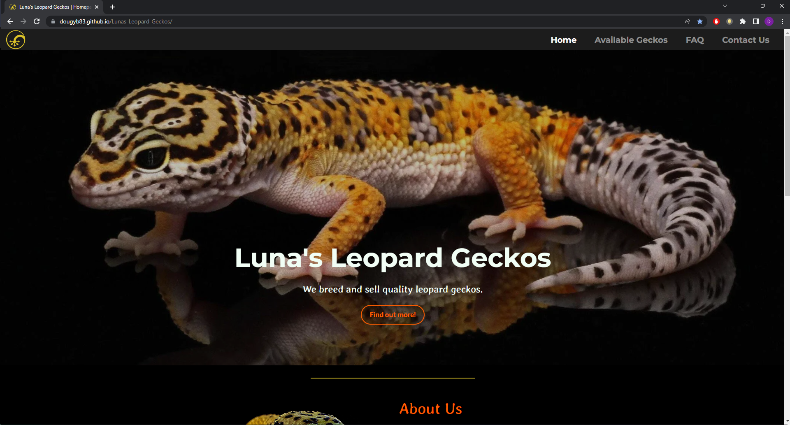
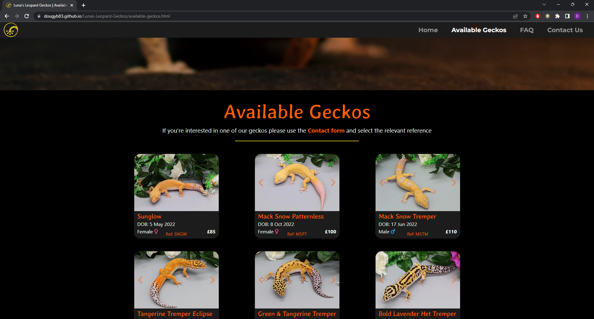
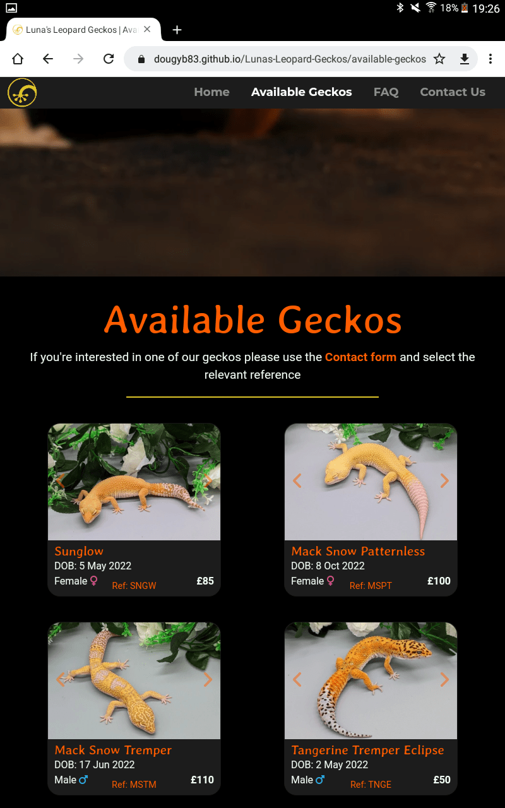
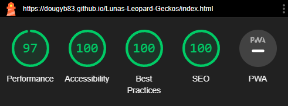

# Testing

Return back to the [README.md](README.md) file.

## Code Validation

### HTML

I have used the recommended [HTML W3C Validator](https://validator.w3.org) to validate all of my HTML files.

| Page     | W3C URL                                                                                                     | Screenshot                                              | Notes                               |
| -------- | ----------------------------------------------------------------------------------------------------------- | ------------------------------------------------------- | ----------------------------------- |
| Home     | [W3C](https://validator.w3.org/nu/?doc=https://dougyb83.github.io/Lunas-Leopard-Geckos/index.html)   |      | Pass: No Errors  |
| Available geckos  | [W3C](https://validator.w3.org/nu/?doc=https://dougyb83.github.io/Lunas-Leopard-Geckos/available-geckos.html) |   | Section lacks heading h2-h6 warning            |
| FAQ     | [W3C](https://validator.w3.org/nu/?doc=https://dougyb83.github.io/Lunas-Leopard-Geckos/faq.html)    |      | Section lacks heading h2-h6 warning                     |
| Contact | [W3C](https://validator.w3.org/nu/?doc=https://dougyb83.github.io/Lunas-Leopard-Geckos/contact.html)   |  | Section lacks heading h2-h6 warning      |
| Confirmation |[W3C](https://validator.w3.org/nu/?doc=https://dougyb83.github.io/Lunas-Leopard-Geckos/confirmation.html)    |  | Pass: No Errors                     |
| 404        | [W3C](https://validator.w3.org/nu/?doc=https://dougyb83.github.io/Lunas-Leopard-Geckos/404.html)  |  | Pass: No Errors |

### CSS

I have used the recommended [CSS Jigsaw Validator](https://jigsaw.w3.org/css-validator) to validate all of my CSS files.

| File         | Jigsaw URL                                                                                                       | Screenshot                                             | Notes                              |
| ------------ | ---------------------------------------------------------------------------------------------------------------- | ------------------------------------------------------ | ---------------------------------- |
| style.css    | [Jigsaw](https://jigsaw.w3.org/css-validator/validator?uri=https%3A%2F%2Fdougyb83.github.io%2FLunas-Leopard-Geckos) |     | Pass: No Errors                    |

## Browser Compatibility

I've tested my deployed project on multiple browsers to check for compatibility issues.

| Browser           | Screenshot                                     | Screenshot                                     | Screenshot                                     | Screenshot                                     | Notes                                |
| ----------------- | ---------------------------------------------- | ---------------------------------------------- | ---------------------------------------------- | ---------------------------------------------- | ------------------------------------ |
| Chrome            |   |   |   |   | Works as expected                    |
| Firefox           |   |   |   |   | Works as expected                    |
| Edge              |   |   |   |   | Works as expected                    |
| Brave             |   |   |   |   | Works as expected                    |
| Opera             |   |   |   |   | Works as expected                    |

## Responsiveness

I've tested my deployed project on multiple devices to check for responsiveness issues.

| Device             | Screenshot                                        | Screenshot                                        | Screenshot                                        | Screenshot                                        | Notes                               |
| ------------------ | ------------------------------------------------- | ------------------------------------------------- | ------------------------------------------------- | ------------------------------------------------- | ----------------------------------- |
| Mobile (DevTools)  |   |   |  |  |Works as expected                   |
| Tablet (DevTools)  |   |   |  |  |Works as expected                   |
| Desktop            |  |   |  |  |Works as expected                |
| Google Pixel 4a |    |   |  |  | Works as expected                  |
| Samsung Galaxy S8          |   |   |  |  | Works as expected                  |
| Samsung Galaxy S21 Ultra          |   |   |  |  | Works as expected                   |
| Samsung Galaxy tab 4          |   |   |  |  | Works as expected                   |

## Lighthouse Audit

⚠️⚠️⚠️⚠️⚠️ START OF NOTES (to be deleted) ⚠️⚠️⚠️⚠️⚠️

Use this space to discuss testing the live/deployed site's Lighthouse Audit reports.
Avoid testing the local version (especially if developing in Gitpod), as this can have knock-on effects of performance.

If you don't have Lighthouse in your Developer Tools,
it can be added as an [extension](https://chrome.google.com/webstore/detail/lighthouse/blipmdconlkpinefehnmjammfjpmpbjk).

Don't just test the home page (unless it's a single-page application).
Make sure to test the Lighthouse Audit results for all of your pages.

**IMPORTANT**: You must provide screenshots of the results, to "prove" that you've actually tested them.

Sample Lighthouse testing documentation:

🛑🛑🛑🛑🛑 END OF NOTES (to be deleted) 🛑🛑🛑🛑🛑

I've tested my deployed project using the Lighthouse Audit tool to check for any major issues.

| Page    | Size    | Screenshot                                                | Notes                                   |
| ------- | ------- | --------------------------------------------------------- | --------------------------------------- |
| Home    | Mobile  |      | Some minor warnings                     |
| Home    | Desktop |     | No major problems                            |
| Available Geckos   | Mobile  |     | No major problems                     |
| Available Geckos   | Desktop |    | No major problems                            |
| FAQ | Mobile  |   | Some minor warnings  |
| FAQ | Desktop |  | No major problems  |
| Contact | Mobile |  | No major problems  |
| Contact | Desktop |  | No major problems  |

## User Story Testing

⚠️⚠️⚠️⚠️⚠️ START OF NOTES (to be deleted) ⚠️⚠️⚠️⚠️⚠️

Testing user stories is actually quite simple, once you've already got the stories defined on your README.

Most of your project's **features** should already align with the **user stories**,
so this should as simple as creating a table with the user story, matching with the re-used screenshot
from the respective feature.

🛑🛑🛑🛑🛑 END OF NOTES (to be deleted) 🛑🛑🛑🛑🛑

| User Story                                                                             | Screenshot                               |
| -------------------------------------------------------------------------------------- | ---------------------------------------- |
| As a new site user, I would like to ____________, so that I can ____________.          |  |
| As a new site user, I would like to ____________, so that I can ____________.          |  |
| As a new site user, I would like to ____________, so that I can ____________.          |  |
| As a returning site user, I would like to ____________, so that I can ____________.    |  |
| As a returning site user, I would like to ____________, so that I can ____________.    |  |
| As a returning site user, I would like to ____________, so that I can ____________.    |  |
| As a site administrator, I should be able to ____________, so that I can ____________. |  |
| As a site administrator, I should be able to ____________, so that I can ____________. |  |
| As a site administrator, I should be able to ____________, so that I can ____________. |  |
| repeat for all remaining user stories                                                  | x                                        |

## Bugs

⚠️⚠️⚠️⚠️⚠️ START OF NOTES (to be deleted) ⚠️⚠️⚠️⚠️⚠️

It's very important to document any bugs you've discovered while developing the project.
Make sure to include any necessary steps you've implemented to fix the bug(s) as well.

For JavaScript and Python applications, it's best to screenshot the errors to include them as well.

**PRO TIP**: screenshots of bugs are extremely helpful, and go a long way!

🛑🛑🛑🛑🛑 END OF NOTES (to be deleted) 🛑🛑🛑🛑🛑

- JS Uncaught ReferenceError: `foobar` is undefined/not defined

  

  - To fix this, I _____________________.
- JS `'let'` or `'const'` or `'template literal syntax'` or `'arrow function syntax (=>)'` is available in ES6 (use `'esversion: 11'`) or Mozilla JS extensions (use moz).

  

  - To fix this, I _____________________.
- Python `'ModuleNotFoundError'` when trying to import module from imported package

  

  - To fix this, I _____________________.
- Django `TemplateDoesNotExist` at /appname/path appname/template_name.html

  

  - To fix this, I _____________________.
- Python `E501 line too long` (93 > 79 characters)

  

  - To fix this, I _____________________.

### GitHub **Issues**

⚠️⚠️⚠️⚠️⚠️ START OF NOTES (to be deleted) ⚠️⚠️⚠️⚠️⚠️

An improved way to manage bugs is to use the built-in **Issues** tracker on your GitHub repository.
To access your Issues, click on the "Issues" tab at the top of your repository.
Alternatively, use this link: https://github.com/dougyb83/Lunas-Leopard-Geckos/issues

If using the Issues tracker for your bug management, you can simplify the documentation process.
Issues allow you to directly paste screenshots into the issue without having to first save the screenshot locally,
then uploading into your project.

You can add labels to your issues (`bug`), assign yourself as the owner, and add comments/updates as you progress with fixing the issue(s).

Once you've sorted the issue, you should then "Close" it.

When showcasing your bug tracking for assessment, you can use the following format:

🛑🛑🛑🛑🛑 END OF NOTES (to be deleted) 🛑🛑🛑🛑🛑

**Fixed Bugs**

All previously closed/fixed bugs can be tracked [here](https://github.com/dougyb83/Lunas-Leopard-Geckos/issues?q=is%3Aissue+is%3Aclosed).

| Bug                                                                                                                                           | Status |
| --------------------------------------------------------------------------------------------------------------------------------------------- | ------ |
| [JS Uncaught ReferenceError: `foobar` is undefined/not defined](https://github.com/dougyb83/Lunas-Leopard-Geckos/issues/1)                     | Closed |
| [Python `'ModuleNotFoundError'` when trying to import module from imported package](https://github.com/dougyb83/Lunas-Leopard-Geckos/issues/2) | Closed |
| [Django `TemplateDoesNotExist` at /appname/path appname/template_name.html](https://github.com/dougyb83/Lunas-Leopard-Geckos/issues/3)         | Closed |

**Open Issues**

Any remaining open issues can be tracked [here](https://github.com/dougyb83/Lunas-Leopard-Geckos/issues).

| Bug                                                                                                                                                                                                                                          | Status |
| -------------------------------------------------------------------------------------------------------------------------------------------------------------------------------------------------------------------------------------------- | ------ |
| [JS `'let'` or `'const'` or `'template literal syntax'` or `'arrow function syntax (=>)'` is available in ES6 (use `'esversion: 11'`) or Mozilla JS extensions (use moz).](https://github.com/dougyb83/Lunas-Leopard-Geckos/issues/4) | Open   |
| [Python `E501 line too long` (93 &gt; 79 characters)](https://github.com/dougyb83/Lunas-Leopard-Geckos/issues/5)                                                                                                                              | Open   |

## Unfixed Bugs

⚠️⚠️⚠️⚠️⚠️ START OF NOTES (to be deleted) ⚠️⚠️⚠️⚠️⚠️

You will need to mention unfixed bugs and why they were not fixed.
This section should include shortcomings of the frameworks or technologies used.
Although time can be a big variable to consider, paucity of time and difficulty understanding
implementation is not a valid reason to leave bugs unfixed.

If you've identified any unfixed bugs, no matter how small, be sure to list them here.
It's better to be honest and list them, because if it's not documented and an assessor finds the issue,
they need to know whether or not you're aware of them as well, and why you've not corrected/fixed them.

Some examples:

🛑🛑🛑🛑🛑 END OF NOTES (to be deleted) 🛑🛑🛑🛑🛑

- On devices smaller than 375px, the page starts to have `overflow-x` scrolling.

  

  - Attempted fix: I tried to add additional media queries to handle this, but things started becoming too small to read.
- For PP3, when using a helper `clear()` function, any text above the height of the terminal does not clear, and remains when you scroll up.

  

  - Attempted fix: I tried to adjust the terminal size, but it only resizes the actual terminal, not the allowable area for text.
- When validating HTML with a semantic `section` element, the validator warns about lacking a header `h2-h6`. This is acceptable.

  

  - Attempted fix: this is a known warning and acceptable, and my section doesn't require a header since it's dynamically added via JS.

⚠️⚠️⚠️⚠️⚠️ START OF NOTES (to be deleted) ⚠️⚠️⚠️⚠️⚠️

If you legitimately cannot find any unfixed bugs or warnings, then use the following sentence:

🛑🛑🛑🛑🛑 END OF NOTES (to be deleted) 🛑🛑🛑🛑🛑

There are no remaining bugs that I am aware of.
